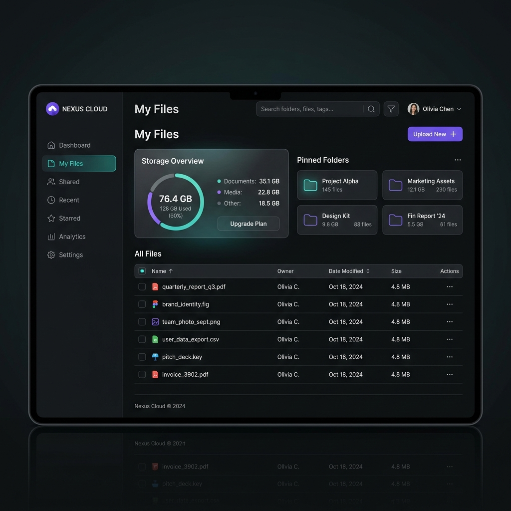

# CloudVault Server ☁️

[](https://github.com/kudipudibhargav/CloudVault)
[](https://github.com/kudipudibhargav/CloudVault)
[](https://github.com/kudipudibhargav/CloudVault)
[](https://github.com/kudipudibhargav/CloudVault)

A secure, resilient, and collaborative cloud storage home for modern enterprise teams.



---

## Why is this so awesome? 🤩

*   🔒 **Zero-Knowledge Encryption:** Secure E2E client-side encryption options prevent raw document binaries from exposing to cloud providers.
*   ⚡ **Zero-Copy Ingestion:** Multi-part file uploads compile directly in-storage using the S3 Compose API, completely avoiding JVM server memory buffers.
*   🛡️ **Resilience4j Fallbacks:** Gateway API is protected with fallback circuit breakers degrading metadata registries to offline indicators on latency spikes.
*   💬 **Threaded Live Collaboration:** Redis Pub/Sub backbones coordinate WebSockets to broadcast active collaborator cursors and comments.
*   🔍 **Vector Semantic Search:** AI analysis pipelines run OCR and PDF text summaries, populating search tags matching queries like *"Find my resume"*.

---

## Get your CloudVault 🚚

### Prerequisites
*   Java Development Kit (JDK) 21
*   Node.js v20+
*   Docker & Docker Compose

### Step 1: Boot Infrastructure Services
Spin up PostgreSQL, Redis caching, MinIO Object Storage, and RabbitMQ:
```bash
docker-compose up -d
```

### Step 2: Compile Java Modules
Compile all submodules using the root-level Maven wrapper:
```bash
.\tools\apache-maven-3.9.6\bin\mvn.cmd clean package -DskipTests
```

### Step 3: Run the Microservices
Boot each Spring Boot jar in separate terminals:
```bash
# 1. API Gateway (Port 8080)
java -jar cloudvault-gateway/target/cloudvault-gateway-1.0.0-SNAPSHOT.jar

# 2. Auth Service (Port 8081)
java -jar cloudvault-auth/target/cloudvault-auth-1.0.0-SNAPSHOT.jar

# 3. Core Metadata Service (Port 8082)
java -jar cloudvault-core/target/cloudvault-core-1.0.0-SNAPSHOT.jar

# 4. Transfer Service (Port 8083)
java -jar cloudvault-transfer/target/cloudvault-transfer-1.0.0-SNAPSHOT.jar
```

### Step 4: Launch the React Client UI
Initialize and run the frontend dev environment:
```bash
cd cloudvault-ui
npm install --legacy-peer-deps
npm run dev
```
Open **[http://localhost:5173/](http://localhost:5173/)** to access the dashboard workspace!

---

## Folder Structure Map 📁

```
CloudVault/
├── docker-compose.yml           # Database, Cache, Storage & Observability Services
├── prometheus.yml               # Metrics scraping configurations
├── cloudvault-common/           # Shared Exceptions & Global ApiResponse Wrappers
├── cloudvault-gateway/          # Spring Cloud Gateway routing & Redis Rate Limiter
├── cloudvault-auth/             # Identity & Access (TOTP 2FA, OAuth2 login)
├── cloudvault-core/             # Folder tree, Sharing expirable links, and AI Summaries
├── cloudvault-transfer/         # Ingestion stream, Zero-copy assembly, and http-206
└── cloudvault-ui/               # React, TypeScript, Zustand, and Tailwind client
```

---

## Get in touch 💬

*   **Forum:** [Community Discussions](https://github.com/kudipudibhargav/CloudVault/discussions)
*   **Security Reporting:** Submit issues regarding security vulnerabilities directly in [HackerOne Bounty Programs](https://github.com/kudipudibhargav/CloudVault/security).
*   **Contributing:** Please read our Code of Conduct and submit pull requests referencing active issue tickets.

---

## License 📄
This project is licensed under the MIT License - see the LICENSE file for details.
